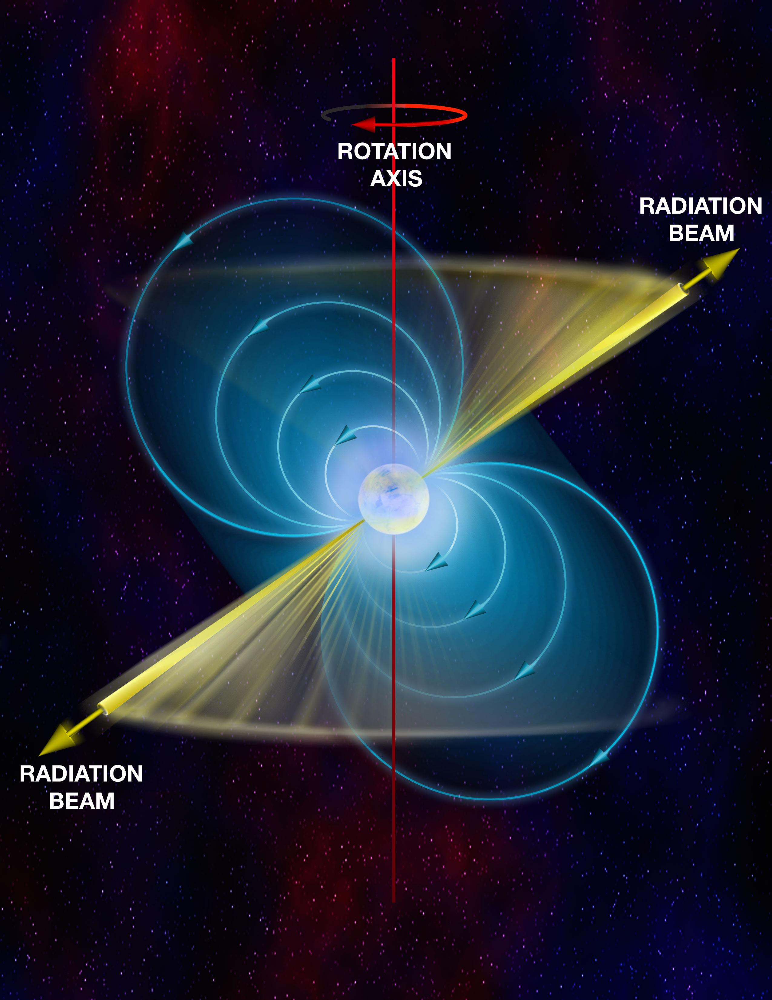
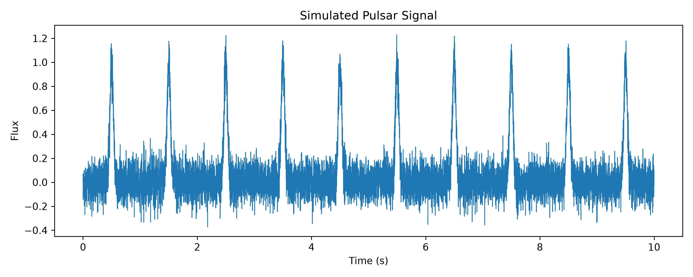
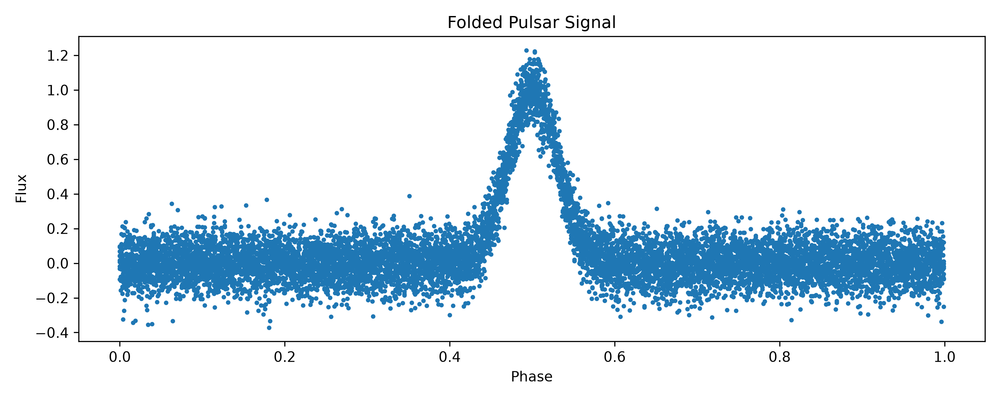
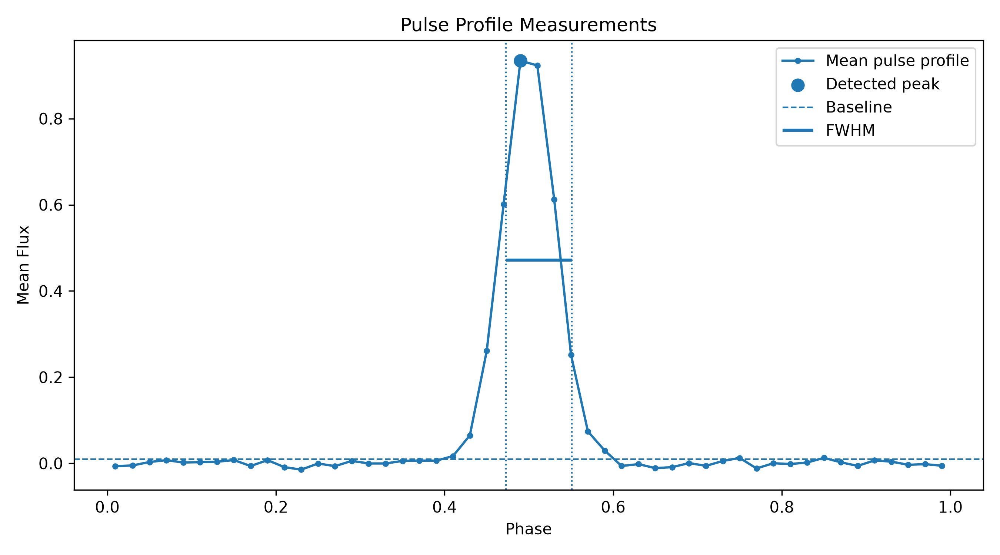
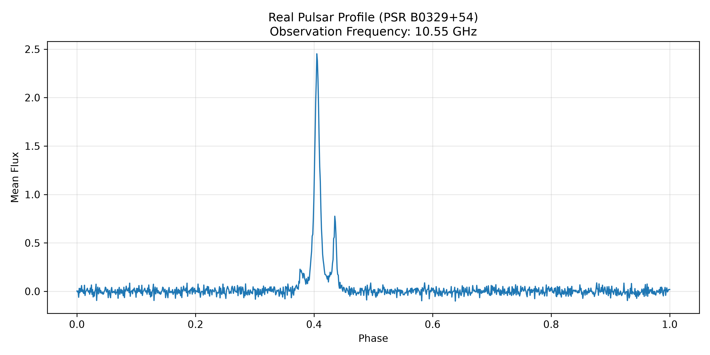

<p align="center">
  
</p>

<h1 align="center">Pulsar Signal Analysis</h1>

<p align="center">
  <strong>Scientific signal-processing pipeline for synthetic and real radio-pulsar observations</strong>
</p>

<p align="center">
  
  
  
  
  
</p>

---

## Overview

**Pulsar Signal Analysis** is a modular scientific Python application for simulating, processing, and measuring radio-pulsar signals.

The project combines:

- synthetic signal generation,
- Fourier-based period estimation,
- phase folding,
- pulse-profile construction,
- automatic peak detection,
- Full Width at Half Maximum measurement,
- Signal-to-Noise Ratio estimation,
- Monte Carlo validation,
- and analysis of a real pulsar profile from the European Pulsar Network.

An interactive command-line interface allows users to select either synthetic or real-data analysis. In simulation mode, the physical and computational parameters can be modified directly from the terminal without editing the source code.

---

## Scientific Background

### What is a pulsar?

A pulsar is a rapidly rotating, strongly magnetized neutron star.

Neutron stars are formed when the core of a sufficiently massive star collapses during a supernova explosion. The remaining object is extremely compact: a typical neutron star has a diameter of only a few tens of kilometres while containing a mass comparable to, or greater than, that of the Sun.

<p align="center">
  
</p>

The magnetic axis of a pulsar is generally not aligned with its rotation axis. Charged particles accelerated near the magnetic poles produce beams of electromagnetic radiation that sweep across space as the neutron star rotates.

When one of these beams crosses Earth's line of sight, a pulse is detected. This is commonly described using the **lighthouse model**.

The measured signal is affected by observational noise and may contain weak or complex pulse structure. Signal-processing methods are therefore required to recover the rotational period and characterize the pulse.

Pulsars provide natural laboratories for studying:

- matter under extreme density,
- strong magnetic fields,
- neutron-star rotation,
- stellar evolution,
- relativistic gravity,
- and precision astronomical timing.

---

## Scientific Objective

The project follows two complementary workflows.

### Synthetic-data workflow

A noisy time series containing repeated pulsar-like pulses is generated under controlled conditions. The complete analysis chain is then applied:

1. estimate the dominant rotational period,
2. fold the time series into phase,
3. construct the mean pulse profile,
4. detect and measure the pulse,
5. evaluate the detection quality,
6. repeat the experiment through Monte Carlo simulation.

Because the true simulation parameters are known, this workflow provides a controlled validation environment.

### Real-data workflow

The project also analyzes a processed pulse profile of **PSR B0329+54**, observed at **10.55 GHz** and obtained from the European Pulsar Network database.

The EPN dataset is already a folded pulse profile rather than a raw telescope time series. Therefore, FFT period estimation and phase folding are not repeated for this dataset. The real-data workflow validates the profile-analysis stage:

- pulse-profile loading,
- peak detection,
- FWHM measurement,
- baseline estimation,
- noise estimation,
- and SNR calculation.

This distinction keeps the analysis scientifically transparent while demonstrating that the measurement modules can operate on both simulated and real astronomical profiles.

---

## Key Features

- Synthetic pulsar time-series generation
- User-configurable simulation parameters
- Interactive command-line interface
- Exploratory Data Analysis
- FFT-based period estimation
- Phase folding
- Mean pulse-profile construction
- Automatic pulse-peak detection
- Pulse prominence measurement
- Full Width at Half Maximum estimation
- Pulse-duration calculation
- Baseline and noise estimation
- Signal-to-Noise Ratio calculation
- Monte Carlo validation
- Real EPN pulsar-profile analysis
- Automatic CSV export
- Separate simulation and real-data outputs
- Publication-quality Matplotlib figures
- Modular Python architecture
- Input validation and error handling

---

## Interactive Application

Run the application with:

```bash
python main.py
```

The terminal presents two analysis modes:

```text
==========================================================
                 PULSAR SIGNAL ANALYSIS
==========================================================
       Signal Processing for Pulsar Observations

Choose analysis mode:

  1. Synthetic Pulsar Simulation
  2. Real Pulsar Profile (PSR B0329+54)

  0. Exit
==========================================================
```

In synthetic mode, users can modify parameters such as:

```text
Observation duration (s) [10.0]:
Sampling rate (Hz) [1000]:
Pulsar period (s) [1.0]:
Pulse width (phase) [0.03]:
Pulse amplitude [1.0]:
Noise level [0.1]:
Monte Carlo runs [100]:
```

Pressing `Enter` keeps the default value.

User-selected values apply only to the current run. The defaults stored in `config.py` remain unchanged.

---

## Analysis Workflow

```text
┌─────────────────────────────────────────────────────────┐
│                  SYNTHETIC WORKFLOW                     │
└─────────────────────────────────────────────────────────┘

                 Synthetic Pulsar Signal
                            │
                            ▼
              Exploratory Statistical Analysis
                            │
                            ▼
                Fast Fourier Transform (FFT)
                            │
                            ▼
                  Dominant Period Estimate
                            │
                            ▼
                      Phase Folding
                            │
                            ▼
                  Mean Pulse Profile
                            │
                            ▼
              Peak Detection and Prominence
                            │
                            ▼
                 FWHM and Pulse Duration
                            │
                            ▼
            Baseline, Noise and SNR Estimation
                            │
                            ▼
                  Monte Carlo Validation


┌─────────────────────────────────────────────────────────┐
│                    REAL-DATA WORKFLOW                   │
└─────────────────────────────────────────────────────────┘

              Processed EPN Pulse Profile
                            │
                            ▼
                 EPN ASCII Data Loader
                            │
                            ▼
               Standardized Profile Format
                            │
                            ▼
              Peak Detection and Prominence
                            │
                            ▼
                 FWHM and Pulse Duration
                            │
                            ▼
            Baseline, Noise and SNR Estimation
```

---

# Results Gallery

## Simulated Pulsar Signal

The synthetic time series contains periodic pulse events embedded in Gaussian noise.

<p align="center">
  
</p>

---

## Folded Pulsar Signal

After estimating the dominant period, all rotations are mapped into a common phase interval. The repeated pulses align near the same phase.

<p align="center">
  
</p>

---

## Synthetic Pulse Measurements

The mean profile is used to detect the pulse peak, estimate the baseline and measure the Full Width at Half Maximum.

<p align="center">
  
</p>

---

## Real Pulsar Observation — PSR B0329+54

The real profile contains a strong primary pulse together with additional pulse structure that is absent from the simplified synthetic Gaussian model.

<p align="center">
  
</p>

---

## Example Measurements

### Synthetic simulation

```text
Estimated period: 1.0000 s

Peak phase: 0.5100
Pulse width: 0.0794 phase
Signal amplitude: 0.925
SNR: 22.3
```

### Real observation

```text
Pulsar: PSR B0329+54
Observation frequency: 10.55 GHz
Source: European Pulsar Network

Peak phase: 0.4047
Peak flux: 2.4520
Peak prominence: 2.5464
Pulse width: 0.0099 phase
Pulse duration: 0.006954 s
SNR: 31.78
```

Results may vary slightly for synthetic runs because each simulation contains a different random-noise realization.

---

## Monte Carlo Validation

A single successful simulation does not establish that an analysis method is robust.

The Monte Carlo module repeatedly generates independent observations using the selected physical and computational parameters. Each run contains a new random-noise realization and passes through the same analysis pipeline.

The framework records:

- estimated period,
- pulse measurements,
- SNR,
- success or failure status,
- and run-to-run variation.

For the default configuration, the pipeline has demonstrated stable period recovery and successful pulse detection across repeated simulations.

Monte Carlo validation helps answer questions such as:

- Does the FFT consistently recover the injected period?
- How stable is the measured SNR?
- How strongly do the results depend on random noise?
- At what noise level does detection begin to fail?
- How reproducible are the measured pulse properties?

---

## Signal-Processing Methods

### Fast Fourier Transform

The FFT converts the simulated signal from the time domain into the frequency domain.

A periodic signal produces enhanced spectral power near its rotational frequency. The dominant non-zero frequency is selected and converted into a period:

```text
period = 1 / frequency
```

### Phase folding

Using the estimated period, every timestamp is converted to rotational phase:

```text
phase = (time mod period) / period
```

Measurements from different rotations are therefore mapped into the interval:

```text
0 ≤ phase < 1
```

This aligns repeated pulses and makes their common shape visible.

### Mean pulse profile

The folded data are divided into phase bins. The mean flux in each bin is calculated to reduce random noise and recover the characteristic pulse shape.

### Peak detection

The dominant pulse is detected using peak prominence rather than amplitude alone. Prominence measures how strongly a peak stands out relative to its surrounding baseline.

### Full Width at Half Maximum

The pulse width is measured at half of the pulse amplitude above the estimated baseline.

This provides a reproducible characterization of the pulse duration in phase units.

### Signal-to-Noise Ratio

The off-pulse region is used to estimate:

- the baseline,
- the noise standard deviation,
- and the signal amplitude.

The resulting SNR quantifies how clearly the pulse rises above observational noise.

---

## Real Data Validation

The real-data analysis uses a processed observation of:

| Property | Value |
|---|---|
| Pulsar | PSR B0329+54 |
| Observation frequency | 10.55 GHz |
| Data source | European Pulsar Network |
| Input type | Folded total-power pulse profile |
| Data format | EPN ASCII |
| Profile analysis | Peak, prominence, FWHM, baseline, noise and SNR |

The real-data loader converts the external EPN format into the common internal structure expected by the analysis modules:

```text
phase_center
mean_flux
```

This input-adaptation layer allows the existing pulse-analysis functions to operate without embedding EPN-specific logic inside the scientific algorithms.

The result demonstrates:

- modularity,
- separation of concerns,
- reuse of analysis functions,
- and extensibility to additional pulsar-profile datasets.

---

## Software Architecture

The application is organized into distinct layers:

```text
main.py
   │
   ▼
cli.py
   │
   ├── menu
   ├── user input
   ├── parameter validation
   └── application control
   │
   ▼
pipeline.py
   │
   ├── synthetic workflow
   └── real-data workflow
   │
   ▼
scientific modules
   ├── simulation
   ├── FFT period search
   ├── folding
   ├── profile construction
   ├── peak detection
   ├── Monte Carlo validation
   ├── plotting
   └── data export
```

Each module has a focused responsibility:

- `main.py` — minimal application entry point
- `cli.py` — terminal interface and user-input validation
- `pipeline.py` — orchestration of the complete workflows
- `simulate.py` — synthetic-signal generation
- `real_data.py` — EPN profile loading and normalization
- `period_search.py` — FFT-based period estimation
- `folding.py` — conversion from time to phase
- `profile.py` — phase binning and mean-profile construction
- `peak_detection.py` — peak, width and SNR measurements
- `monte_carlo.py` — repeated statistical validation
- `plotting.py` — figure creation and export
- `io_utils.py` — tabular-result export
- `config.py` — centralized default parameters

---

## Project Structure

```text
pulsar-signal-analysis/
│
├── assets/
│   ├── banner.jpg
│   ├── pulsar_image.jpg
│   └── gallery/
│       ├── simulated_signal.png
│       ├── folded_signal.png
│       ├── pulse_measurements.png
│       └── psr_b0329_54_profile.png
│
├── data/
│   └── real/
│       └── b0329_54_10550mhz.asc
│
├── results/
│   ├── simulation/
│   │   ├── measurements.csv
│   │   ├── monte_carlo_results.csv
│   │   └── generated figures
│   │
│   └── real_data/
│       └── generated figures
│
├── src/
│   ├── __init__.py
│   ├── cli.py
│   ├── config.py
│   ├── pipeline.py
│   ├── simulate.py
│   ├── real_data.py
│   ├── eda.py
│   ├── period_search.py
│   ├── folding.py
│   ├── profile.py
│   ├── peak_detection.py
│   ├── monte_carlo.py
│   ├── plotting.py
│   └── io_utils.py
│
├── tests/
├── notebooks/
├── main.py
├── requirements.txt
├── .gitignore
└── README.md
```

---

## Installation

### 1. Clone the repository

```bash
git clone https://github.com/naris93-phcs/pulsar-signal-analysis.git
```

```bash
cd pulsar-signal-analysis
```

### 2. Create a virtual environment

```bash
python -m venv .venv
```

### 3. Activate the virtual environment

Windows PowerShell:

```powershell
.venv\Scripts\Activate.ps1
```

Windows Command Prompt:

```cmd
.venv\Scripts\activate
```

Linux or macOS:

```bash
source .venv/bin/activate
```

### 4. Install dependencies

```bash
pip install -r requirements.txt
```

### 5. Run the application

```bash
python main.py
```

---

## Technologies

- Python
- NumPy
- Pandas
- SciPy
- Matplotlib
- pathlib
- Git and GitHub
- Black
- flake8

---

## Design Principles

The project emphasizes:

- modular architecture,
- reproducible analysis,
- separation of scientific logic from user interaction,
- centralized configuration,
- reusable processing functions,
- controlled simulation experiments,
- input validation,
- transparent real-data handling,
- and clear scientific documentation.

---

## Limitations

The synthetic signal uses a simplified pulse model and Gaussian noise. Real pulsar observations may contain:

- multiple pulse components,
- frequency-dependent profile evolution,
- interstellar dispersion,
- instrumental effects,
- radio-frequency interference,
- pulse-to-pulse variability,
- and polarization information.

The EPN input used here is already a processed and folded profile. The project does not currently perform raw-telescope calibration, dedispersion or folding of the real observation.

These limitations define a clear boundary between this portfolio-scale analysis pipeline and a complete radio-astronomy data-reduction system.

---

## Future Work

Potential extensions include:

- support for additional EPN pulsars,
- automatic comparison across observing frequencies,
- multiple-component pulse detection,
- harmonic analysis,
- noise-robustness curves,
- detection-efficiency studies,
- configurable random seeds,
- unit and integration tests,
- continuous integration,
- Bayesian parameter estimation,
- raw PSRFITS or filterbank support,
- and interactive visualization.

---

## Author

Developed as a scientific software portfolio project focused on:

- Computational Physics
- Scientific Computing
- Signal Processing
- Astrophysics
- Scientific Data Analysis
- Research Software Engineering

The project demonstrates how physical reasoning, statistical validation and modular software design can be combined into a reproducible Python workflow for both simulated and real astronomical data.

---

## License

This project is distributed under the MIT License.